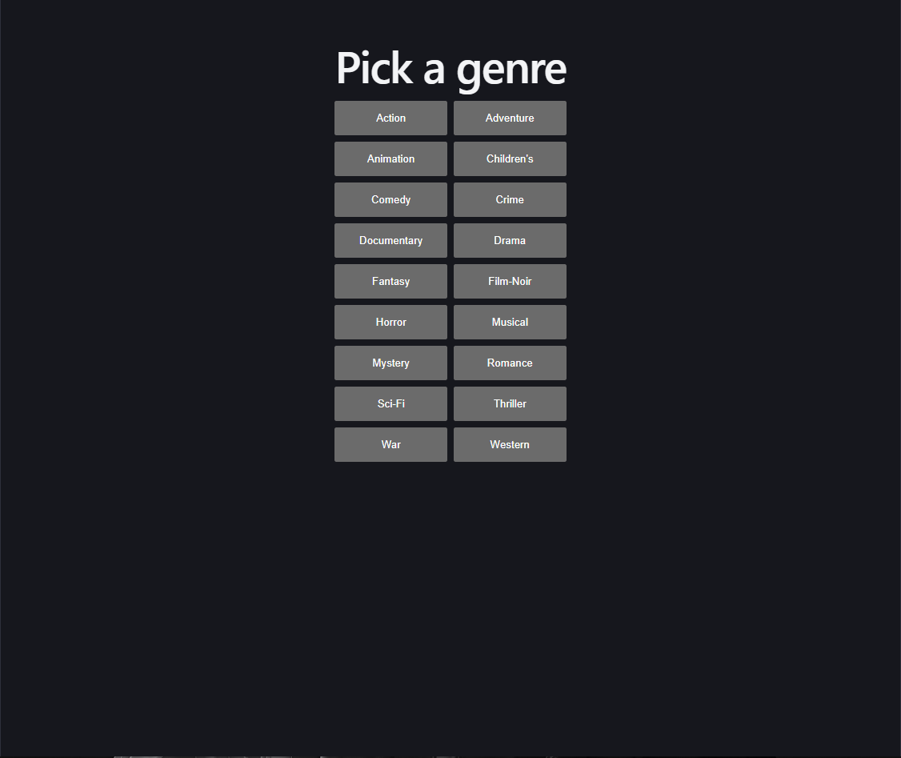
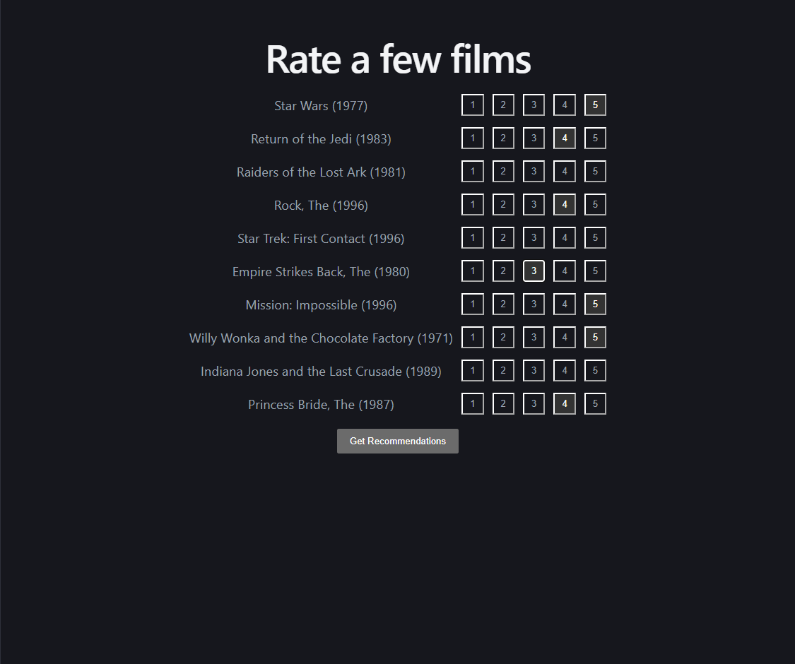

# MovieLens Recommender

A full-stack movie recommender built on the MovieLens 100k dataset. Biased matrix factorization trained with SGD from scratch — no recommender libraries — served through a FastAPI backend and a React frontend.

**Live demo:** https://movielens-recommender-ivory.vercel.app

The user picks a genre, rates a handful of popular films from it, and gets a personalized ranked list. A new user has no row in the trained user-factor matrix, so their taste vector is solved on the fly (a ridge-regularized least-squares fold-in against the fixed item factors), then used to score the full catalog.

> Note: the backend runs on a free tier that sleeps when idle, so the first request after a period of inactivity can take 30–50 seconds to wake.

## Screens

Pick a genre to start:



Rate a few popular films from that genre:



Get a ranked, personalized list:


## How it works

The model predicts a rating as a global mean plus user and item bias terms plus the dot product of latent factors:

```text
r_hat_ui = mu + b_u + b_i + p_u · q_i
```

Factors and biases are learned by stochastic gradient descent over the observed ratings only — the ~94% of the user–item matrix that is unobserved contributes nothing to the loss, which is why plain SVD does not apply and the factors are fit iteratively with L2 regularization.

For a new user, the user vector `p_u` is solved directly against the fixed item factors of the films they just rated:

```text
p_u = (Qr^T Qr + lam * I)^-1 Qr^T (r - mu - b_i)
```

where `Qr` is the item-factor rows for the rated films. This is a 50×50 solve, effectively instant, and it lets the app personalize from a handful of ratings without retraining.

## Results

Recall@10 is reported for warm users (present in training) and cold users (test-only, served a popularity fallback) separately, because a single blended number hides which population is actually being served. Warm-user metrics are averaged across 5 fixed random seeds so run-to-run variation from random initialization is visible rather than hidden behind one decimal.

Warm Recall@10 across the five-seed sweep (seeds 42–46):

| Seed | Warm Recall@10 |
|------|----------------|
| 42   | 0.0458 |
| 43   | 0.0493 |
| 44   | 0.0446 |
| 45   | 0.0423 |
| 46   | 0.0535 |

Summary:

- Mean warm Recall@10: **0.0471** (range 0.0423–0.0535)
- Warm popularity baseline: **0.0318**
- Overall Recall@10: **0.0649**

The model beats the popularity baseline on warm users at every seed — the population where personalization is actually possible — by 33–68% relative. The margin varies across seeds by roughly a quarter of its mean, so the finding is stated as a range, not a single figure.

Rating-prediction error at 20 epochs (seed 42):

- Train RMSE: **0.846**
- Test RMSE: **0.986**

Test RMSE was still decreasing at epoch 20, so the model had not begun to overfit within this training budget. No hyperparameter search was run beyond the defaults.

The cold Recall@10 figure is **not a model result**. The 192 test users with no training history receive the popularity list as a fallback. It scores higher than the warm figure because new accounts tend to rate mainstream films, making them an easier population to predict — not a better-served one.

## Match percentage

The "match" value shown on each recommendation is a compressed rank-based scale (top result ~99%, tapering down within the returned set). It reflects position in the ranked list, **not** a calibrated confidence or probability. It exists to make the demo legible; the underlying signal is the predicted-rating ranking.

## Tech

- **Model / pipeline:** Python, NumPy, pandas — matrix factorization and evaluation written from scratch
- **Backend:** FastAPI, served with Uvicorn; loads the trained factors and item metadata once at startup
- **Frontend:** React + Vite
- **Deploy:** backend on Render, frontend on Vercel

CORS is intentionally open (`allow_origins=["*"]`) because this is a public, read-only demo with no authentication or user data — the endpoints only read precomputed data.

## Data

Download MovieLens 100k and extract it so the files land in `data/`:

    https://files.grouplens.org/datasets/movielens/ml-100k.zip

The pipeline expects `data/u.data`, `data/u.item`, and `data/u.genre`. The raw dataset is gitignored; the small trained artifacts the API needs (factor matrices and metadata JSON) are committed so the deploy can boot without retraining.

## Run it locally

Backend:

```bash
python split.py        # temporal train/test split
python train.py        # trains, saves factors + meta.json (set TRAIN_SEED to change seed)
python items.py        # builds items.json (titles, years, genres, rating counts)
uvicorn api:app --reload
```

Frontend:

```bash
cd frontend
npm install
npm run dev            # set VITE_API_URL to point at the backend
```

## Files

- `split.py` — chronological train/test split
- `train.py` — SGD matrix factorization; saves `P/Q/bu/bi.npy` and `meta.json`
- `items.py` — builds `items.json` item metadata
- `evaluate.py` — Recall@10 for warm/cold/overall, plus the seed sweep
- `api.py` — FastAPI: `/health`, `/genres`, `/genres/{name}/popular`, `/recommend`
- `frontend/` — React + Vite app

## Limitations

- The catalog ends around 1998, so every recommendation is a pre-1999 film.
- Popularity is computed once from the training split and never updates. A production system would recompute it on a rolling window.
- The train/test split is positional rather than by timestamp value, so the boundary timestamp appears in both sets.
- 66 items appear only in the test set. They have no learned factors and can never be recommended.
- 192 of 943 users are cold at evaluation time.
- Warm Recall@10 varies by roughly a quarter of its mean across seeds, so a single run is not a reliable figure.
- The fold-in personalizes weakly with very few ratings — with only 2–3 films rated, the solved vector is small and the ranking falls back toward popular, well-liked titles. Personalization strengthens noticeably with more input.
